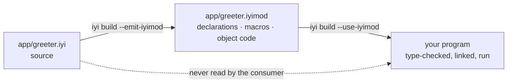

# iyi

[](https://github.com/jwaldrip/iyi/actions/workflows/iyi.yml)
[](LICENSE)

**A language built for Developer & Agentic Experience, Portability, Performance,
and Efficiency.** (*iyi* is Turkish for "good".)

Those four are one design decision seen from four sides. A module is the unit of
compilation and it is compiled against its dependencies' **declarations**, never
their bodies — so a build reads less, a program carries less, a tool can read an
interface without a repository, and a person waits less. Everything below is
that rule and what it costs.

| | measured today |
|---|---|
| **Developer experience** | edit one module in a 7,207-line project and rebuild: **0.13 s**, against Crystal's 1.17 s and `go build`'s 0.16 s |
| **Agentic experience** | a module's interface is a file, not a convention: `iyi mod context` grounds an edit in every import's exact surface at **43–55%** of the sources' size (`--budget N` cuts it further by a stated ladder), and a model writing against it spent **35–43% fewer prompt tokens** over eight measured runs, no more rounds (`bench/context_pack.py`, both arms). The loop is one verb per step: `iyi check` is the verdict as data with `suggested_edit` spans, `iyi fix` applies them to convergence, `iyi test --affected` runs only what an edit can reach, `iyi run --sandbox` executes generated code against a runtime holding nothing, and `iyi mcp`/`iyi lsp` serve it all over the two protocols agents and editors speak (`bench/agent_loop.py`, `bench/lsp_session.py`) |
| **Portability** | an iyi program compiles for **nine targets** and is **run** on four of them every build: x86-64 glibc, x86-64 musl, aarch64 under emulation, and wasm32-wasi under wasmtime |
| **Performance** | native code through LLVM, and a front end that answers `hello` in **0.031 s**. At run time the two libraries are within noise where they do the same work |
| **Efficiency** | that `hello` is a **36 KB** binary that starts in **1.6 ms**; the same program with Crystal's library is 1,553 KB and 3.2 ms |

**iyi is its own language, and it is compatible with
[Crystal](https://crystal-lang.org).** Compatible in a way you can check: the
same compiler builds `.cr` files, `iyi build --crystal` gives a program
Crystal's standard library, and `require "kemal"` in an iyi file serves HTTP.
Its own in a way you can also check: a `.iyi` file has rules Crystal does not
have and refuses things Crystal accepts, and those rules are the whole of what
follows. The compiler is built on Crystal's, which is recorded where it belongs
— the [licence](LICENSE) and [NOTICE.md](NOTICE.md).

Here is the program the numbers below are about. One script writes it three
times, in iyi, in Crystal and in Go, from the same set of numbers:

* **30 modules**, one file each, 10 types per module: 300 types, **7,207
  lines**.
* **one `main`** that calls a function in all thirty modules, adds up what they
  answer, and prints the total.
* **the edit**: a single number, in one function, in one of the thirty modules.

One of the thirty, as iyi, with nine of its ten types left out:

```crystal
module parts/mod0

pub struct Widget0
  @a : Int32
  @b : Int32

  def initialize(@a : Int32, @b : Int32)
  end

  def score : Int32
    ((@a * 3) + (@b * 5)) % 1000
  end

  def blend(other : Widget0) : Int32
    (score + other.score) % 1000
  end
end

pub def total0 : Int32
  edit_point = 0            # the line the benchmark changes, then rebuilds
  w0 = Widget0.new(0, 0)
  (edit_point + w0.score + w0.blend(w0)) % 100000
end
```

Change that line and build again. Best of seven, one Linux machine, seconds:


<sup>The bars run in real time, and `…` is `--use-iyimod mods --emit-iyimod mods`.
Drawn by the run that measured it: `python3 bench/incremental.py --svg doc/assets/edit-loop.anim.svg`.</sup>

| | iyi | Crystal | `go build` |
|---|---|---|---|
| **rebuild after one edit** | **0.13** | 1.17 | 0.16 |

**Three builds of the same program, by the same compiler binary twice.** All
three print the same total, and `bench/incremental.py` refuses to start the
clock until they do. The Crystal column is no straw man: it is this compiler,
under the rule iyi drops. A Crystal class is open until the last line of the
last file, so no build may trust anything it read last time and every rebuild
reads all 7,207 lines again. Take that one rule away and the line you just
changed costs **9x less**. Go is in the table because Go is good at exactly
this, and is the bar worth clearing.

The syntax stays: union types, nil-safety, blocks, local inference. What
changes is the compilation model, and everything that model forces. The design
is in [SPEC.md](SPEC.md), which records what was measured, what was thrown away
and why; no number in this README is quoted from anywhere else, and the command
that prints each one is named beside it.

**Where it loses**, said here rather than left to be found: a full build of a
6,912-line program from scratch is 0.24 s against `go build`'s 0.09 s. The
current compiler reports `0.9.0`. iyi's own prelude carries the small-tool
floor — `puts`, stdin, whole-file `File` read/write, `Program.args`/`.env` —
and no more: no sockets, no TLS, no serialisation. Its concurrency — a
cooperative scheduler, `group`/`spawn`,
`Channel`, cancellable `sleep` and reads (SPEC.md III.4) — runs on Linux
(x86_64, aarch64) and macOS arm64 only;
`--crystal` supplies Crystal's standard library, IO, `require` and the
ecosystem. Dependencies exist but are young: an `iyi.mod` beside the entry
file names requirements, resolution is minimal version selection over git
tags and `iyi.sum` pins what arrived (SPEC.md III.7), but there is no
registry and no artifact distribution yet; `--crystal` still leans on
shards.

## The program that makes the argument

A web framework's DSL, with the Sinatra feel intact. The library exports names.
The program picks which ones it wants unqualified. Nothing gets injected into
anybody's namespace.

```crystal
module samples/webapp

import kemal/dsl
import kemal/router

using kemal/dsl                        # get, post, mount: because this file asked
using kemal/router::{Router, Context}

get "/" do |env|
  "home"
end

get "/count" do |env|
  42                                   # anything implementing IntoBody, not just String
end

users = Router.new
users.namespace "/admin" do |admin|
  admin.get "/dashboard" do |env|
    "dashboard"
  end
end

mount "/v1", users
```

That file is [`samples/iyi/webapp.iyi`](samples/iyi/webapp.iyi), a port of
[Kemal](https://kemalcr.com)'s router, and it runs. Now add a route whose
handler returns something a body cannot be made of:

```crystal
get "/bad" do |env|
  [1, 2, 3]
end
```

```console
$ iyi build samples/iyi/webapp.iyi
In webapp.iyi:33:1

 33 | get "/bad" do |env|
      ^--
Error: Array(Int32) does not implement Kemal::Router::IntoBody, required by `B` in `get`
```

**Kemal cannot say this.** It accepts the same block and serves an empty body,
on every request, forever. Here the handler's return type is a type parameter
bounded by a trait. The framework's promise, "give me something I can turn into
a body", is checked at the line where the mistake is, by a module that has never
heard of your types.

The same program also builds when the framework's source is not on the machine:

```console
$ iyi build --emit-iyimod mods samples/iyi/webapp.iyi   # writes kemal/router.iyimod, ...
$ rm -rf samples/iyi/kemal                              # the library's source, gone
$ iyi build --use-iyimod mods samples/iyi/webapp.iyi    # builds, links, runs, same output
```

## What it costs, measured

**The loop a person is actually in.** Nobody uses a language through full
builds. This is the project from the top of the README, all of it: 30 modules,
7,207 lines, written three times by one generator and refused unless the three
binaries print the same total. Best of 7, release compiler, one idle Linux box
(AMD Ryzen AI 9 465 under WSL2, LLVM 19.1.7, Go 1.25.2), seconds:

| what changed | iyi | Crystal | `go build` |
|---|---|---|---|
| **one module's body** | **0.13** | 1.17 | 0.16 |
| the entry file only | **0.12** | 1.15 | 0.16 |
| nothing at all | 0.12 | 1.14 | 0.08 |
| nothing cached anywhere | 0.61 | 1.97 | 3.09 |
| the same edit, *without* artifacts | 0.23 | — | — |

**The last row is R-1 with a price on it.** The same edit with all thirty
modules read from source costs 0.23 s; with the `.iyimod` files in hand the
other twenty-nine arrive as declarations and it costs 0.13 s. The rule pays
1.8x on the loop it was written for, and pays more as the code you are *not*
editing grows.

**Two caveats, both against us.** `go build` from nothing compiles its own
dependencies once, which iyi has none of, so the 3.09 s is a first build on a
fresh machine rather than a claim about Go's compiler. And these seconds are a
machine, not a language: two sessions this machine's own reference accepts read
0.13 / 1.17 / 0.16 and 0.16 / 1.29 / 0.19 on the first row, and a tired session
reads 0.22 / 1.81 / 0.27. The ratios hold across all three. Read the columns
against each other, since they pay the same machine together.

**The full build, which is the row iyi loses.** `python3 bench/build_speed.py`,
same session:

| program | iyi | `go build` |
|---|---|---|
| `hello` (147 lines) | **0.07 s** | 0.08 s |
| generated pair, 6,912 lines | 0.24 s | **0.09 s** |

<sup>Both counts are `wc -l`: 147 for `samples/iyi/hello.iyi`, of which 44 are
code and the rest the commentary that makes it a sample, and 6,912 for what
`python3 bench/build_speed/generate_pair.py 300 <dir>` writes. The Go side of
each row is 11 lines and 6,016.</sup>

iyi is quick where fixed costs are the whole bill and quick on the loop, and it
is not quick at compiling a lot of code it has never seen: roughly 25 ms per
thousand lines. The front end alone is 0.034 s for `hello` against a target of
0.050 s, and 0.018 s of that is the process starting up before it reads
anything.

## The rules everything follows from

| Rule | |
|---|---|
| **R-1** | A module is the unit of compilation. `import` forms a DAG. Compiling a module reads its dependencies' **declarations**, never their bodies. |
| **R-2** | Everything a module exports (`pub`) writes down full parameter and return types. Unexported code infers as usual. |
| **R-2b** | `using` brings exported names into unqualified scope. The consumer writes it, not the library. |
| **R-2c** | A def whose parameters and return are all written is typed at its definition, caller or no caller. A build, `check` and the LSP cannot disagree about "clean". |
| **R-3** | No open classes. `impl Trait for Type` lives in the module that declares the trait or the type. |

R-1 is what a `.iyimod` file is: a module's declarations, the bodies a consumer
has to compile for itself, and its machine code, in one file. R-3 is what lets a
consumer answer "does this type implement that trait?" without reading anything
else.



The dotted line is the whole design. A consumer type-checks against the
declarations and links against the object code, and the source of the module it
imports may not exist on the machine at all.

## The four, and what stands behind each

Said plainly, because a tagline that outruns its evidence is worth less than no
tagline.

**Developer experience — built, and it is the number this project exists for.**
The edit loop is 0.13 s where Crystal's is 1.17 s on the same 7,207 lines, and
that is R-1 paying: the twenty-nine modules you did not touch arrive as
declarations. The rest of it is smaller and just as deliberate — errors name the
rule they enforce and what to write instead, `iyi tool format` knows the syntax,
and `iyi mod dump` prints an artifact as text.

**Agentic experience — the mechanism is built, the claim is young.** What an
agent needs from a language is a boundary it can read and a loop it can afford.
Both are here for the same reason a person gets them: a module's interface is a
*file* rather than a convention, so a tool can read what a module offers without
the repository that produced it, and check a change against it without building
the world.

"Did this change reach anybody?" is therefore a question with an answer:

```console
$ iyi mod diff before/app/greeter.iyimod after/app/greeter.iyimod
module          app/greeter
interface       changed    what a consumer type-checks against
implementation  unchanged  the bodies a consumer compiles: macros, generics, the initialiser
source          changed    the file

  gone   def polite(name : String) : String
  gone   def title : String
  new    def polite(name : String, formal : Bool) : String

Consumers have to be rebuilt: what they compile against moved.
```

Rename a local and it says the interface is unchanged; add a parameter and it
says what moved and who it reaches. `--exit-code` makes that a branch in a
script. Nothing here is agent-specific: it is R-1's boundary, asked a question.

What *is* here is deliberately unspecial: `iyi lsp` is a standard protocol
over the same rules — completion, references, rename, hover and diagnostics are the front end
answering, and the two methods beyond LSP (`iyi/contextPack`,
`iyi/surface`) return exactly what the CLI prints. `iyi mcp` is the same
stance on the agent side: the compiler's verbs — `check`, `fix`,
`context`, `test` — as Model Context Protocol tools, each one a shell
around this same binary, so what a harness gets over the wire is
byte-for-byte what a shell would have gotten. No agent mode, no
forked behaviour by consumer; if the rules turn out not to be enough,
that is a thing to measure rather than to promise.

**Portability — compiles for nine, runs on four.** An iyi program produces
code for `x86_64-linux-gnu`, `x86_64-linux-musl`, `aarch64-linux-gnu`,
`arm-linux-gnueabihf`, `x86_64-darwin`, `aarch64-darwin`, `x86_64-w64-mingw32`,
`x86_64-windows-msvc` and `wasm32-wasi`, and CI type-checks the library for all
nine every build.

Four of them are *run*, also every build, and the check is that they print what
the same program printed on the machine that compiled them: x86-64 glibc
natively, **x86-64 musl** in an Alpine container, **aarch64** under emulation,
and **wasm32-wasi** under wasmtime. The object is cross-compiled here and
linked there with the target's own toolchain, which is the command
`--cross-compile` prints.

Darwin is still "the code generator has no objection", and needs a runner this
workflow does not have. Windows is worse than that and gets its own entry
below: it compiles, it links, and what it prints at run time cannot be trusted.

**Performance — Crystal's backend, and now one measurement of its own.**
Native code through LLVM, the same GC. `python3 bench/runtime.py` runs the same
program under both libraries, and the honest reading is not the flattering one:

| workload | as it runs | with the collector off |
|---|---|---|
| arithmetic | 1.00x | 0.96x |
| array append and read | 0.67x | 0.78x |
| hash insert and read | 0.17x | 0.19x |
| string building | 0.97x | **3.62x** |

Under 1.00 is iyi ahead. These seconds are a machine, not a language: run
`python3 bench/runtime.py` on an idle one. Where the two libraries do the
same work they are within noise. `Hash` is ahead by 5x with the collector
off, and does less (no insertion order). `String` is 3.62x slower with the
collector off, and within noise as it runs: the collector is masking a
slower builder, which is the same confound the first reading published
upside down as a twenty-times win.

One thing here is benchmarked against Go: the collector. `python3
bench/gc_race.py` runs three programs written once in iyi and once in Go —
binary trees, a million live items beside 256 MiB of garbage, and pure
churn — under iyi's own collector, under Boehm as Crystal ships it, and under
Go's, and prints wall time, resident memory and the pauses side by side. On
the machine GC_DESIGN.md records, the longest pause is Go's or under it on
every program (0.09 ms, 0.09 ms, 0.03 ms), the wall time beats Go on all
three and Boehm on two, and the footprint is Go's on churn and a budget or
two over it on the rest. The collector is iyi's own: precise for typed objects, a mark
that runs in parallel on helper threads and beside the program on a write
barrier the compiler emits, a sweep that runs beside the program too, in
slices the helpers take after every collection, and hands pages back to
the kernel. GC_DESIGN.md is the account. What R-4 says about
generics crossing a boundary is specified and unmeasured.

**Efficiency — built, and it is mostly subtraction.** `puts "hello"` is a 36 KB
binary that starts in 1.6 ms; the same program compiled with Crystal's standard
library is 1,553 KB and 3.2 ms. Nothing clever is happening: a program links what
it uses, and iyi's own library is 9,512 lines rather than 8,161. The whole
library is 379 KB on disk beside the binary.

<sup>Sizes and start times are a plain `iyi build`, no flags, on macOS arm64
with LLVM 22. They move with the platform and the LLVM, which is why they are
quoted with the machine attached; `python3 bench/machine_probe.py` prints the
pair for yours. The line counts beside them are `wc -l` and do not move, and
`python3 bench/doc_numbers.py` fails when one of those drifts from the tree.</sup>

## Getting it

The released tarball is 0.9.0, and a build from current source reports the
same.

```console
$ tar -xzf iyi-0.9.0-linux-x86_64.tar.gz -C ~/.local
$ ~/.local/bin/iyi run ~/.local/share/iyi/samples/hello.iyi
```

The tarball is relocatable and carries both libraries: iyi's own 379 KB, and
Crystal's standard library for `--crystal`. `bin/iyi` finds them beside itself,
so there is nothing to configure and no `IYI_PATH` to set. LLVM is inside the
binary — a static minimal build from `scripts/build-static-llvm.sh`, the same
recipe on Linux and darwin — so `lib/` is libgc (and libstdc++ on Linux) and
nothing else, and the package is tens of megabytes because a compiler is,
not because it is carrying a shared LLVM's closure. The one thing it does
not bring is a C toolchain, because iyi links through `cc`; CI proves the
rest by unpacking the tarball in a bare image with nothing but `gcc` in it
and building a program there, and on darwin by `otool -L` naming nothing
outside the package but `/usr/lib` and `/System`.

### An editor, in one stanza

`iyi lsp` speaks the Language Server Protocol over stdio; there is nothing
to configure. Neovim 0.11+:

```lua
vim.filetype.add { extension = { iyi = "iyi" } }
vim.lsp.config("iyi", { cmd = { "iyi", "lsp" }, filetypes = { "iyi" } })
vim.lsp.enable("iyi")
```

Any LSP client works the same way: command `iyi lsp`, filetype `.iyi`;
`editors/` carries a VS Code extension and the one-stanza configs for
Helix and Zed. Diagnostics arrive on every keystroke from a real
compile of the module alone — 36 ms p50 / 55 ms p95 across the sample
corpus, measured by `bench/lsp_latency.py` in CI — and an error that
cites the spec carries the section as its diagnostic code.
Completion lists a receiver's methods with their written signatures;
references and rename ride the typed graph, so an overload that shares a
name but not a resolution stays put, and a rename reaches the `using`
line that selects the old name. Two requests go beyond the protocol for
harnesses: `iyi/contextPack` returns the file's grounding pack and
`iyi/surface` a module's rendered surface, unsaved buffers included
(`bench/lsp_session.py` is the whole contract, runnable).

### Your first module, and then the rule that matters

Two files. `app/greeter.iyi` is a module, and its path is its file's path:

```crystal
module app/greeter

pub def polite(name : String) : String
  "Hello, #{name}."
end
```

`main.iyi` imports it, and then asks for its names by writing `using`. The
library does not get to put them there:

```crystal
module main

import app/greeter
using app/greeter

puts polite("world")
```

```console
$ iyi run main.iyi
Hello, world.
```

Now the part the language is for. Build it once, keeping each module's
artifact, then **delete the library's source** and build again:

```console
$ iyi build --emit-iyimod mods -o hello main.iyi
$ rm -r app                                     # the library, gone
$ iyi build --use-iyimod mods -o hello main.iyi
$ ./hello
Hello, world.
```

The second build never sees `polite`'s body. It reads
`mods/app/greeter.iyimod`, which carries the declarations it type-checks
against and the machine code it links, and that is R-1: a module compiles
against what its imports *say*, not against what they *do*.

What a plain build using iyi's own prelude depends on. On Linux the object
asks libc for nothing: the prelude issues its own syscalls for `write`, `exit`
and the allocator, so `nm -u` on the emitted object prints nothing at all. The
linked build still uses libc because the C toolchain's link template adds the
startup objects, and the executable carries their five undefined references
(`__libc_start_main`, `__gmon_start__`, `__cxa_finalize` and two weak
`_ITM_` callbacks). That distinction is the whole of it, and CI is what taught
it: a claim measured on an object is not a claim about the binary. `--static`
is where "no libc" becomes literally true, below. On macOS the object asks
`libSystem` for its staples, the concurrency runtime's poller and the
collector's `mmap`/`munmap` (SPEC.md III.4.8, GC_DESIGN.md) — because that
is Apple's only supported interface.
Crystal's published required-libraries list is thirteen long. An own-prelude
program reaches none of them: no libgc, no libevent, no openssl, no zlib —
and since the collector became the default, that costs no collection
either: a plain build allocates from the owned arena, collects under its
own allocation-pressure trigger, and still adds not one library. The
doors out are `-Dgc_none` (the old bump pointer: allocate, never free,
the last nanosecond of the fast path) and `-Dgc_boehm` (bdw-gc, making
libgc its one dependency).

`bench/dependency_floor.sh` measures own-prelude builds, not `--crystal`.
`--crystal` links Crystal's standard library and may pull every library a
required shard pulls. Both modes still link through a C toolchain, so a
compiler on the machine is the one thing a build needs.

**In own-prelude mode, the binary travels as one file.** On Linux,
`iyi build --static` passes
`-static` to the C toolchain, and the object it links has zero undefined
symbols (`nm -u` prints nothing), so the binary comes out with no dynamic
loader at all: copy it to a bare Linux and run it, the way a Go binary
travels. On macOS that is not on offer, and it is said here rather than left
to be found: Apple ships no static libc, and the linker refuses, `ld: library
'crt0.o' not found`. The default build there links one library, `libSystem`,
part of the OS, so the file still copies to another Mac and runs. Windows is
the same shape, importing only `kernel32`, which ships with the machine, and
`--static` links the static CRT there. A wasm32 build is one self-contained
module already.

Building it instead needs LLVM 19 and a Crystal compiler to bootstrap from:

```console
$ make                                  # the compiler, and `iyi` itself
$ ./bin/iyi run samples/iyi/hello.iyi   # run it out of the checkout
$ sudo make install_iyi                 # or install it, PREFIX=/usr/local
```

`make` also builds the same compiler under Crystal's name, as `./bin/crystal`.
That one compiles `.cr` files and is what the specs and the benches use,
because underneath this is still Crystal's compiler.

## The library a program has

A prelude is a library, and the rules are the language. Those are two different
things, so a program can keep one and change the other.

**`iyi build --crystal` gives a program Crystal's standard library**, and there
`require` means what it means in Crystal. This is a Kemal server, and it runs:

```crystal
module site

require "kemal"

get "/" do |env|
  "Hello from an iyi program"
end

get "/json" do |env|
  env.response.content_type = "application/json"
  {message: "iyi"}.to_json
end

Kemal.run
```

```console
$ iyi build --crystal -o site site.iyi
$ ./site &
$ curl localhost:3000/json
{"message":"iyi"}
```

**Nothing about the language changes.** The module header, `import`, `using`,
`pub`, traits with defaults, `impl … forall`, error unions and `!`, `.or`,
`or_panic`, `defer` — all of them, on a program that requires a shard. R-2
still refuses an export that does not write its types. What changes is what the
program *has*: 8,161 lines of Crystal's standard library instead of 9,512
lines of iyi's own prelude.

**One name is unreachable, and it is a class of names.** `!` in iyi propagates
an error, so a method whose name ends in one cannot be called from a `.iyi`
file — `a.sort!` asks the compiler to propagate `Array(Int32)`'s errors, and it
says so. Crystal's standard library has **51 such names**, `not_nil!`, `sort!`,
`map!`, `select!` and `uniq!` among them. What replaces them is what Crystal
writes anyway when it wants a copy or a narrowing:

```crystal
a = a.sort              # rather than a.sort!
if home = maybe         # rather than maybe.not_nil!
  ...
end
maybe.as(String)        # or this
```

Shard code is `.cr` and unaffected; this is only about the lines you write.

**What it costs is R-1, for that dependency.** A required shard is read from
source, so your edit loop pays for it the way Crystal's does.

**Your own modules still get artifacts.** `--crystal` and `--use-iyimod` work
together: a module that requires `json` compiles once into a `.iyimod`, and a
program that requires Kemal links against it without opening its source.

```console
$ iyi build --crystal --emit-iyimod mods -o site site.iyi
$ iyi build --crystal --use-iyimod mods -o site site.iyi
```

The artifact carries the requires the module made, and the program replays them
— so a module that used `URI` brings `URI` with it. There is exactly one copy
of the library in the result: `STDOUT` is the same object on both sides of the
boundary, and so is every lazily initialised constant.

**What that saves is small, and the honest number is worth more than the
feature.** On a twelve-module app with Crystal's library, the modules cost
0.16 s from source and nothing from artifacts — against 3.1 s for the library
itself, which every build reads from source. Under iyi's own prelude the same
trade goes the other way: the library is 0.03 s and the artifact is the whole
build. R-1 is only as fast as the part of your program it covers.

**Some of the library's cost is what `iyi daemon` removes.** Start one in
another terminal and it holds Crystal's library analysed between builds:

```console
$ iyi daemon start &
$ iyi daemon build --crystal -o site site.iyi
```

Front end only, so the term it removes is visible rather than diluted by
codegen — a full build adds code generation and a link that it does not touch:

| twelve-module app, `--no-codegen` | normal | through the daemon |
|---|---|---|
| twelve modules | 0.77–0.85 s | **0.44–0.49 s** |
| twelve modules and Kemal | 1.15–1.36 s | 0.93–1.13 s |
| the same, with Kemal in a `--prelude` file | 1.15–1.36 s | **0.57–0.66 s** |

**About 0.3 s**, and roughly 200 MB of resident memory per prelude it holds.

The third row is the one worth reading: it is the largest by some way, and it
does not come from holding the prelude — it comes from holding *Kemal*. What
the daemon is really good at is holding your program's dependencies, and it
only does that if you name them in a prelude file of your own:

```crystal
# _prelude.cr
require "prelude"
require "kemal"
```

```console
$ iyi daemon build --prelude ./_prelude.cr -o site site.iyi
```

Set `CRYSTAL_DAEMON_SOCKET` and an ordinary `iyi build` goes through it too,
falling back to a normal build when nothing is listening. The daemon is for
`--crystal`: iyi's own prelude takes 0.03 s to analyse, so there is nothing
there worth holding.

**What the two libraries do not do is mix.** A `.iyimod` records which one it
was built against, and importing across is refused by name. That refusal is not
a limitation waiting to be lifted: both are compiled by the same compiler and
mangle the same names, so a mixed program would link — on the names that happen
to agree. `String` is a different type in each, and nothing after the linker
would say so.

**Nine shards were swept through it**, each built twice — as an iyi program and
as a Crystal one, so that a difference is iyi's and a shared failure is
the ecosystem's. `kemal`, `db`, `ameba`, `habitat`, `baked_file_system`,
`radix`, `sqlite3`, the standard library's own `json`/`yaml`/`uri`/`http`, and
a program that round-trips `JSON::Serializable` and writes a file. All nine
behave the same in both languages.

One of them needed a word changed, and it was the rule working: `habitat`'s
macro resolves the type it is handed by name, and a class an iyi module leaves
unmarked is private, so it needs `pub class`. A macro from another module
reaching your type is exactly what `pub` governs.

**The compiler itself links four libraries.** Crystal's published
required-libraries list is thirteen long. `otool -L` on a locally built `iyi`
prints libLLVM, libc++, libgc and libSystem, and nothing else; on the
released binary libLLVM is absent from the list because it is inside the
binary. LLVM is the back
end and libc++ arrives with it. libgc is there because `-Dgc_none` was tried
on the compiler and does not survive it: invalid IR on some runs, a crash in
`main_user_code` on others. pcre2 was the fifth entry. Regex literals in four
standard library files compiled into the compiler held it there. Macro-level
regex now runs on iyi's own engine, those four files parse by hand, and the
library is off the line. `bench/dependency_floor.sh` holds the compiler to
that list and forbids `libpcre` outright. SPEC.md III.10 records the
verification and the `Spec::CLI#pattern` type change that removal cost.

## More of the language

**Traits, and impls for a generic type.** Nothing to reopen, nothing to monkey
patch. A type gets behaviour from an `impl`, and that `impl` lives with the
trait or with the type.

```crystal
pub trait Show
  abstract def show : String
end

pub struct Box(T)
  getter value : T

  def initialize(@value : T)
  end
end

impl Show for Box(T) forall T          # forall introduces T, and is required
  def show : String
    "Box(#{value})"
  end
end

puts Box.new(41).show                  # => Box(41)
puts Box.new("hi").show                # => Box(hi)
```

`forall` is not ceremony: without it, whether `T` names a new parameter or a
type already in scope would depend on what the file imports, and a library
could change the meaning of your `impl` by adding an export.

**One `each`, fifty-seven methods.** `samples/iyi/std/enumerable.iyi` is
`Enumerable` ported to a trait: one requirement, 57 defaults. Implement the
requirement, answer the associated type, and the rest arrives. It is checked
once at the `impl`, not at every call.

```crystal
pub struct Nums
  def initialize(@a : Array(Int32))
  end
end

impl Enumerable for Nums
  type Elem = Int32                    # the associated type, answered by the impl
  def each(& : Int32 -> Nil) : Nil
    @a.each { |x| yield x }
  end
end

n = Nums.new([3, 1, 4, 1, 5])
puts n.to_a.join(",")                  # => 3,1,4,1,5
puts n.map { |x| x * 2 }.join(",")     # => 6,2,8,2,10
puts n.sorted.join(",")                # => 1,1,3,4,5
puts n.first                           # => 3
```

**Errors are ordinary union members.** No `Result` wrapper, no exception
hierarchy, no new machinery. A union already carries a type id. What makes a
member an *error* member is that its type implements `Error`.

```crystal
pub def load(path : String) : Int32 | IOError | ParseError
  text = read(path)!                   # ! returns the error member from here,
  to_number(text)!                     # or narrows to the value and carries on
end

case load(path)
in Int32      then puts "read #{it}"
in IOError    then puts "io:    #{it.message}"
in ParseError then puts "parse: #{it.message}"
end
```

Add an error to `load`'s return type and every caller hears about it, because an
incomplete `case` does not compile. Delete the `ParseError` branch from the
sample and the compiler names what is missing:

```console
$ iyi build samples/iyi/errors.iyi
In errors.iyi:64:3

 64 | case load(path)
      ^
Error: case is not exhaustive.

Missing types:
 - Samples::Errors::ParseError
```

## When you break a rule

The rules are new, so the compiler teaches them where they are broken. Import a
module and call one of its functions the way every other language would:

```console
Error: undefined method 'polite' for App::Main:Module

`polite` is exported by `app/greeter`, and this file has not written `using`.
Add `using app/greeter` to bring its names in unqualified, or call it as
`App::Greeter.polite` (SPEC.md R-2b)
```

Write the `using` and forget the `import`:

```console
Error: `app/greeter` is not imported here. `using` brings in the names of a
module this file has already imported, so this needs `import app/greeter`
above it (SPEC.md R-1, R-2b)
```

Write an `impl` in a module that owns neither the trait nor the type, which is
the one R-3 exists for:

```console
Error: can't implement Lib::Shape::Drawable for Lib::Shape::Circle in App::Main:
an impl must live in the module that defines the trait (Lib::Shape) or the
module that defines the type (Lib::Shape). This is R-3, the orphan rule, and it
is what lets coherence be checked without a global pass
```

Each one names the rule and the line to write. A language whose rules are
unfamiliar has to teach them at the moment they are broken, or it has invented
a new way to be stuck.

## The samples

Nine programs in [`samples/iyi`](samples/iyi), each documenting a part of the
design rather than showing off: `hello` (traits and `impl`), `modules`
(`import` and `using` across files), `generics`, `errors`, `collections`,
`immutable` (a shareable collection and the copy that makes it safe),
`init_order` and `webapp`. And `basics`, which documents nothing: it is the six
programs a person writes in their first half hour, and it is there because the
prelude grows only when a program in this repository needs something.

R-1 is checked rather than asserted. `bash bench/samples_roundtrip.sh` builds
the five samples that import anything, deletes every imported module's source,
builds again from the artifacts and compares what the two programs print. CI
runs it on every push.

An artifact is readable:

```console
$ iyi mod dump mods/kemal/router.iyimod | head -20
module        kemal/router
compiler      0.9.0
...
exports
  pub struct Context
    @method : String
    @path : String
    def initialize(method : String, path : String)
```

And it is checked when it is read. Each section carries a checksum, so a
`.iyimod` that was truncated by a full disk, half-copied into a cache or
damaged in transit is refused by name rather than compiled against: a single
flipped byte used to build seven times out of ten, and reach the linker the
other three with an error that never mentioned the artifact.

## Coming from Crystal

**Both directions of "compatible", stated first.** The same compiler builds
`.cr` files unchanged, and `iyi build --crystal` lets an iyi program `require`
any of them — Kemal, `db`, `ameba`, the standard library. The direction that
does not work is a Crystal program requiring an iyi module: R-2's written types
and R-3's closed types are what an artifact is made of, and a `.cr` file
provides neither. So iyi consumes Crystal, and Crystal does not consume iyi.

The syntax is Crystal's. What moved is where things may be written, and each
move is one of the four rules:

| Crystal | iyi | why |
|---|---|---|
| `require "foo"` pulls a file into the program | `import app/foo` names a module, and the module's path is its file's path | R-1: a module is a unit, so it has a name rather than a location in a concatenation |
| a `require`d file's names are simply *there* | `using app/foo` brings them in, written by the consumer | R-2b: a library cannot take a name in your file |
| reopen any class, anywhere, including `String` | you may not reopen | R-3: what a type is, is settled where it is written |
| `include`/`extend` a module into a class | `trait` and `impl Trait for Type`, in the trait's module or the type's | R-3's orphan rule, which is what makes coherence checkable without reading the program |
| `abstract def` in a module | `abstract def` in a `trait`, and the trait is a type | II.6 |
| everything is public unless `private` | everything is the module's own unless `pub`, and `pub` writes its types | R-2 |
| shards, `shard.yml` | `--crystal` can `require` shards from `IYI_PATH` | no package manager; required source is compiled into the program |
| macros | kept, and they travel in the artifact | |
| `Nil`, union types, blocks, local inference | kept, unchanged | |

A `.cr` file still compiles: this is Crystal's compiler, and `./bin/crystal`
runs it under its own name. The rules above apply to `.iyi` files.

## Questions you are about to ask

**Is this Crystal with a flag?** No, and the difference is not cosmetic. A
`.iyi` file has rules Crystal does not have and refuses things Crystal accepts:
a module header that makes the file a compilation unit, `pub` with types on
everything exported, no open classes, `impl` where the trait or the type lives,
errors as ordinary union members. Separate compilation is not a feature you add
to a language with open classes; it is a rule a language is designed around, and
these are those rules.

**What does "Crystal-compatible" mean, exactly?** Three things, each of them
checkable. The same compiler builds `.cr` files unchanged — nine shards were
swept through it, Kemal among them. An iyi program can `require` any of them
with `--crystal`, and gets Crystal's standard library with it. And the syntax
under the rules is Crystal's: blocks, unions, nil-safety, macros, local
inference. What is not compatible is the direction back — a Crystal program
cannot `require` an iyi module, because R-2's written types and R-3's closed
types are what the artifact is made of.

**Is this meant to replace Crystal?** No. Crystal is not going to drop open
classes, and it should not.

**Will it merge back?** The bug fixes found in Crystal's own compiler while
building iyi should, and they are separate commits for that reason. The rules
will not, and are not offered.

**Can I use shards?** Yes, with `--crystal`, which gives the program Crystal's
standard library and makes `require` mean what it means there. Nine shards were
swept through it, Kemal among them. There is still no package manager: point
`IYI_PATH` at a `lib/` directory the way Crystal does. What you give up is
R-1 for the required shard, which is compiled from source rather than read as
declarations.

**Is the syntax stable?** No. 0.9.0 is a release of a language that is still
moving, and the parts of SPEC.md marked PROPOSED are exactly the parts that
will move.

**Which targets are checked?** CI cross-compiles and audits the emitted object
for seven triples: Linux x86_64 and aarch64, macOS x86_64 and aarch64, Windows
msvc and gnu, and wasm32-wasi. `x86_64-linux-musl` and
`arm-linux-gnueabihf` type-check but are not object-audited. This does not claim
that the test suite runs on every target.

**Who is this for right now?** Somebody who wants to check the claim, read the
design, or argue with a number. `--crystal` moved the other line: a program
that requires shards is buildable today, and what should keep you away is the
language rather than the library — master is 0.9.0, and the parts of SPEC.md
marked PROPOSED are the parts that will move under you.

## What is not here

- **iyi's own library is 9,512 lines, and its IO is `puts`, `print`,
  `read_input` and `File`**: integers, booleans, a string, one sequence, one
  dictionary, one range. `read_input` returns everything on standard input as
  one string, because there is no `IO` to keep the rest in. `File.read`,
  `File.write`, `File.exists?` and `File.delete` are the file surface.
  `samples/iyi/files.iyi` writes, reads and deletes its file. No sockets, no
  format strings.
  `--crystal` is the other library and has all of it; everything below this
  line is about iyi's own.
- **The prelude's collections are smaller than Crystal's.** A method is in
  there because a program in this repository needed it, so most of what you
  reach for is not; `samples/iyi/std/enumerable.iyi` is where the rest is
  being written, as trait defaults. `a[-1]` indexes from the end, the way
  Crystal's does; out of range after that wrap still raises.
  `samples/iyi/formatting.iyi` is the rest of the small set: `to_s(base)`,
  `rjust` / `ljust`, and `*`.
- **`Share` gates nothing yet, and two platforms have no runtime.** SPEC.md
  III.4's structured concurrency — `group`/`spawn`, `Channel`, `select`,
  cancellation delivered as values, panics dying at task boundaries — is
  built in iyi's own prelude and runs on Linux (x86_64, aarch64) and macOS
  arm64 (epoll there, kqueue here; SPEC.md III.4.8). A kernel thread is
  here too — `IyiThread.start { }`, III.4.11, not a task and stopped by
  the collector — and its block may capture only `Share` values: III.4.4's
  marker, decided per type from whether any method assigns a field, and
  the compiler names the variable, the type and the field when it refuses
  one. What is *not* here: wasm32 and Windows
  get no runtime rather than a sequential imitation — a `group` there fails
  to compile, which III.4.8 chose by name over shipping a spelling without
  the feature. A program built `--crystal` has Crystal's fibers, which are
  the thing III.4 was written to replace rather than an answer to it.
- **No package manager and no self-hosting.** `--crystal` gives a program
  Crystal's standard library; nothing gives it a package manager.
- **No native test matrix across the supported targets.** CI type-checks the
  library for nine triples and audits the emitted objects of an iyi program for
  seven of them on four platforms: Linux x86_64 and aarch64, macOS x86_64 and
  aarch64, Windows msvc and gnu, and wasm32-wasi. Five of those are also
  *run*: `hello.iyi` is cross-compiled for `x86_64-linux-musl`,
  `aarch64-linux-gnu` and `wasm32-wasi`, linked with the target's own linker,
  and run natively in a container, under emulation, and under wasmtime, each
  checked against what the same program printed on the machine that compiled
  it — and `aarch64-darwin` has its own native job, which builds the release
  compiler, holds the same gates, and ships the darwin tarball.
  `x86_64-windows-msvc` and `arm-linux-gnueabihf` are not among them.
  Nothing here claims that the test suite runs on any target but the one CI
  builds on.
- **A Windows binary runs right now, and only that much is claimed.**
  `x86_64-windows-msvc` compiles and links: the object asks Windows for six
  `kernel32` functions and nothing else, and with `kernel32` and the
  *dynamic* CRT named (the static one, `libcmt`, links just as cleanly and
  access-violates before `main`) the linker is happy. It used to be broken at
  run time three different ways — the right answer, memory it was never
  given (`ache\w` where `HELLO, IYI!` belongs, `BEEP ` with the digits gone),
  and `0xC0000005`, on the same binary with nothing changed between runs.
  The wild write was the prelude's own `memset`, striding eight elements per
  eight bytes; SPEC III.9 12c tells it whole. CI runs the binary twenty
  times with a 50,000-iteration self-check in each, watched without failing
  until thirty-six builds in a row read twenty right and nothing else, and
  it is a gate now. What is not claimed: Windows is not a test target, has
  no collector (its allocator is `HeapAlloc`, never freed) and no threads,
  and nothing here has run on it but that probe.
- **A wasm program needs a wasi toolchain, not just a linker.** A wasm32-wasi
  module is a program only once wasi-libc's entry stub is linked in, and only
  the compiler driver knows where its sysroot keeps that object — so this fork
  prints `cc --target=wasm32-wasi` for the target rather than `wasm-ld`, and CI
  runs that command with wasi-sdk's clang as the `cc` it names. What the prelude
  carries is the name the stub calls: clang renames a C `main` to
  `__main_argc_argv`, the entry calls *that*, and a module defining only `main`
  links without complaint and then traps on `unreachable` the first time the
  entry calls through the weak reference it left behind.
- **Artifacts are identified by released version, target and flag set.** Builds
  of the same released version read each other's `.iyimod` files only on the
  same target under the same flags; anything else is rejected and rebuilt,
  never migrated. A `-dev` build is not a released version: it keeps the build
  commit in its identity and interoperates only with itself. 0.9.0 is
  released, so its artifacts carry the version alone and any 0.9.0 build on
  the same target and flags reads them.
- **A derive reads upwards, and an artifact carries more than the rule says.**
  `derive <macro>` in a class or struct body runs once, in the module that
  declares the type, and what it generates travels in that module's artifact.
  `samples/iyi/derive.iyi` is built from its artifacts with the macro's source
  deleted every build. The macro is handed the declaration's name and its
  fields, each field with the type it was written as, so it can ask whether a
  field's type implements a trait, including a type, trait and impl that all
  arrive from another module's artifact. Several names on one line run in turn.
  Two limits: `getter` declares a field only once it has run, so a derive reads
  the declarations *above* it and refuses rather than quietly skip one written
  below; and while the program-wide macro questions are refused inside a derive,
  a `.iyimod` carries method bodies, so SPEC.md R-5's "never the bodies" is a
  narrower artifact than the one iyi emits. Measured, symmetric, and recorded in
  SPEC.md II.4 rather than enforced.
- **Macros are not hygienic.** `pub macro` exports a name and an arity, and a
  macro is pasted text, so one that writes `tmp = 99` assigns to your `tmp` if
  you have one. That is Crystal's semantics kept whole.

## Where things are

| | |
|---|---|
| [SPEC.md](SPEC.md) | the design, and the record of what measurement settled |
| [`samples/iyi`](samples/iyi) | thirteen programs: eleven documenting a part of it, one being a first half hour, and `calc`, a language |
| [`samples/crystal/kemal`](samples/crystal/kemal) | a kemal application, from `shard.yml`: built from source and across four `.iyimod` boundaries |
| [`src/iyi`](src/iyi) | iyi's own library, 9,512 lines. `--crystal` swaps it for Crystal's |
| [`src/compiler/iyi/iyimod.cr`](src/compiler/iyi/iyimod.cr) | the artifact format |
| [`bench/incremental.py`](bench/incremental.py) | the edit loop, against Go, generated in both languages |
| [`bench/build_speed.py`](bench/build_speed.py) | the full builds, and the gate that fails until the target holds |
| [CHANGELOG.md](CHANGELOG.md) | what is in a release, and what a later one has to keep faith with |
| [README.crystal.md](README.crystal.md) | Crystal's own README, kept |

## Licence and provenance

iyi's compiler is built on the Crystal compiler and carries Crystal's licence
and copyright: Apache 2.0, Copyright 2012-2026 Manas Technology Solutions. See
[LICENSE](LICENSE) and [NOTICE.md](NOTICE.md). Everything here that is not
Crystal's is a change to Crystal's source. `iyi --version` reports
`iyi 0.9.0 (built on Crystal 1.22.0-dev)`: the language first, then what it
is built on. The compatibility binary in the same checkout still reports itself
as `Crystal 1.22.0-dev`, because that is what it is. This paragraph is a licence
obligation and an accurate one; the language above it is iyi's own.
